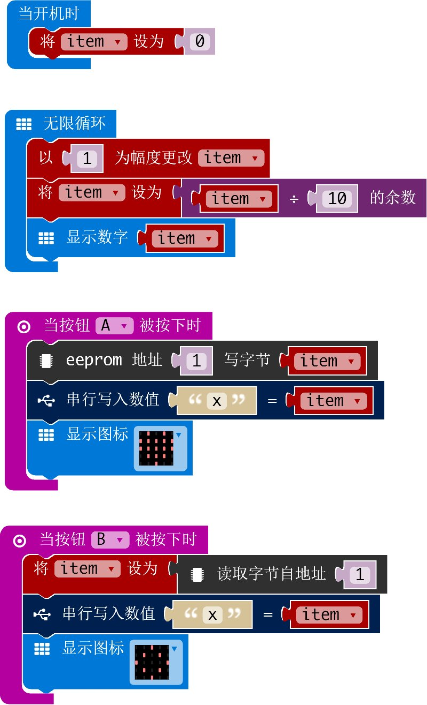

# AT24XX

AT24CXX eeprom pxt 软件包

作者: shaoziyang  
时间: 2018年5月  

  

## 使用方法

打开 makecode 编辑器，在项目中选择添加软件包，然后在地址栏输入下面网址  

https://github.com/microbit-makecode-packages/AT24CXX  

搜索后就可以添加并使用本软件包了。

## I2C 地址  

- 80

## API

- **function write_byte(addr: number, dat: number)**  
写入一个字节到指定地址

- **function read_byte(addr: number)**  
从指定地址读取一个字节

- **function write_word(addr: number, dat: number)**  
写入一个字到指定地址

- **function read_word(addr: number)**  
从指定地址读取一个字

- **function write_dword(addr: number, dat: number)**  
写入一个双字到指定地址

- **function read_dword(addr: number)**  
从指定地址读取一个双字

## 演示

## 授权方式

MIT

microbit/micropython 中文社区版权所有 (c) 2018  

## 支持硬件

* for PXT/microbit

[来自 microbit/micropython 中文社区](http://www.micropython.org.cn)  
